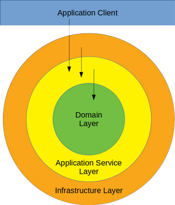

# Rust Example Implementation of a Hexagonal/Onion/Clean Architecture

Inspired by https://github.com/thombergs/buckpal

Kotlin Version: https://github.com/schneidersteve/buckpal-kotlin

## Tech Stack

* [Rust](https://www.rust-lang.org)
* [Rust Async](https://rust-lang.github.io/async-book/)
* [Mockall](https://github.com/asomers/mockall)
* [Salvo](https://salvo.rs)
* [SQLx](https://github.com/launchbadge/sqlx)
* [rust-analyzer](https://rust-analyzer.github.io)
* [Visual Studio Code](https://code.visualstudio.com)

## Layers and Dependency Inversion



## Send Money Use Case

```gherkin
Feature: Send Money

  Scenario: Transaction succeeds
    Given a source account
    And a target account

    When money is send

    Then send money succeeds

    And source account is locked
    And source account withdrawal will succeed
    And source account is released

    And target account is locked
    And target account deposit will succeed
    And target account is released

    And accounts have been updated
```
